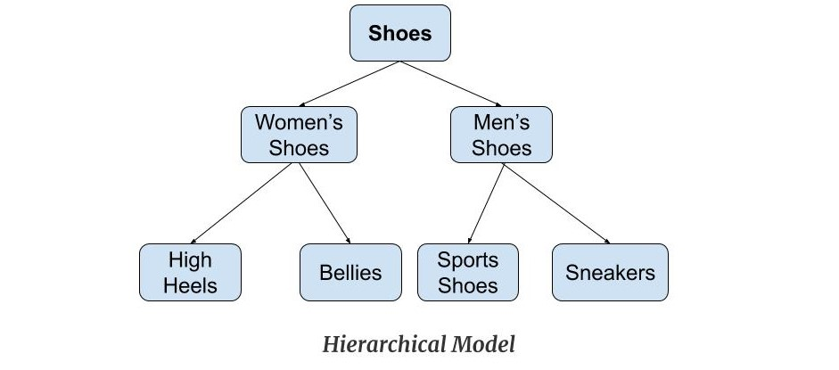

## DBMS ( database management system).
- it is a software that helps you store, organize, retrieve, update, and secure 
data efficiently.
- Before DBMS, computers used File-Based Systems.
   -  students.txt → Student data
   - marks.txt → Marks data
   - fees.txt → Fees data

Problems with File-Based Systems
1. 
 - Data Redundancy
   - Same data stored in multiple files.
 example:
  - Student name in students.txt
  -  Same name again in fees.txt
➡ Waste of memory
➡ Data inconsistency risk

2. Data Inconsistency
- If you update data in one file but forget another:

3. No Data Security
 - Anyone with file access could read or modify data
 - No proper user roles, passwords, or permissions

4. Difficult Data Access

- Suppose you want:
   - “All students who paid fees AND scored above 80”

- You had to:
   - Manually write complex code
   - Read multiple files
   - Match records yourself

5. No Concurrency Control

- If two users modify the same file at the same time:
   - Data corruption possible
   - No locking mechanism

6. No Backup & Recovery
- System crash = data loss
- No automatic rollback or recovery

## DATA vs INFORMATION:

#### DATA:

- Data is raw, unprocessed facts — it has no meaning by itself.
- Examples:
   - 101
   - Tahir
   - 85
   - CS
- Alone, these don’t tell a complete story.

#### INFORMATION:

- Information is processed, organized, and meaningful data.
- Example after processing:

   - Roll No 101, Name Tahir, Marks 85, Course CS

- Now it makes sense ✅

#### 🧠 DBMS Perspective

- DBMS stores data
- DBMS processes data to produce information

#### Why DBMS focuses on DATA (not information)

- Data can be reused in many ways
- Information depends on queries
- Same data → multiple information outputs

## Database vs DBMS

#### database:

- A Database is an organized collection of related data.
- Example:
  - A table storing students:
    - Roll No
    - Name
    - Marks
- 👉 Database = DATA itself

#### DBMS:

- A DBMS (Database Management System) is software used to create, manage, access, and control databases.

- 👉 DBMS = TOOL / SOFTWARE

| Database               | DBMS                         |
| ---------------------- | ---------------------------- |
| Collection of data     | Software to manage data      |
| Passive (cannot act)   | Active (processes data)      |
| Stores data only       | Stores + retrieves + secures |
| No security by itself  | Provides security            |
| Example: Student table | Example: MySQL, Oracle       |

## Types of DBMS

#### 1. Hierarchical DBMS ( 1960 )

- Data organized in tree structure
- One parent → many children
- Each child has only one parent

University
 ├── College
 │    ├── Department
 │    │     └── Student

🔹 Advantages

 - ✔ Simple
 - ✔ Fast access (fixed paths)

❌ Disadvantages
  - ❌ Rigid structure
  - ❌ No many-to-many relationships
  - ❌ Difficult to modify

🔹 Example System
 - IBM IMS

#### 2. Network DBMS (1970s)

- Data organized as graph
- A child can have multiple parents
- Supports many-to-many relationships

🔹 Advantages

- ✔ Flexible than hierarchical
- ✔ Supports complex relationships

❌ Disadvantages
 - ❌ Very complex
 - ❌ Hard to maintain
 - ❌ Programmer-dependent

🔹 Example
- IDMS

#### 3. Relational DBMS (RDBMS) ⭐ (MOST IMPORTANT)
- or sql (Structured Query Language) database
- Data stored in tables (relations)
- Rows = records
- Columns = attributes
- Uses SQL

🔹 Why RDBMS Dominated?

- ✔ Simple table format
- ✔ Powerful SQL
- ✔ Strong data integrity
- ✔ Data independence

🔹 Examples

- MySQL
- PostgreSQL
- Oracle
- SQL Server

#### 4. Object-Oriented DBMS (OODBMS)

- Stores data as objects
- Supports:
  - Encapsulation
  - Inheritance
  - Polymorphism

Used with OOP languages like Java, C++.

❌ Why Not Popular?

 - Complex
 - Poor standardization

🔹 Example
 - ObjectDB

#### 5. NoSQL DBMS (Modern Era)

- Created to handle:
  - Big Data
  - Distributed systems
  - High scalability

- NoSQL databases store data in flexible formats like JSON, key-value pairs, or graphs. They don’t require a fixed schema.
- Example:
    - MongoDB uses JS-like queries, not SQL.

🔹 Types of NoSQL

| Type         | Example   |
| ------------ | --------- |
| Key-Value    | Redis     |
| Document     | MongoDB   |
| Column-Based | Cassandra |
| Graph        | Neo4j     |

🔹 Advantages

- ✔ Scalable
- ✔ Flexible schema
- ✔ High performance

❌ Disadvantages

- ❌ Weak consistency (often)
- ❌ Less ACID

#### 🧠 Evolution Summary (Very Important)

File System
   ↓
Hierarchical DBMS
   ↓
Network DBMS
   ↓
Relational DBMS
   ↓
NoSQL DBMS

## DBMS Architecture (Three-Level Abstraction)

Why Do We Need DBMS Architecture?

Imagine:

- Users only want results
- Developers want logical structure
- DBMS wants efficient storage

If everyone directly touched the database files → chaos ❌

So DBMS uses levels (abstraction) to:
- ✔ Hide complexity
- ✔ Provide data independence
- ✔ Separate concerns

### 🧱 The 3 Levels of DBMS Architecture

Users
  ↓
External Level (View)
  ↓
Conceptual Level (Logical)
  ↓
Internal Level (Physical)
  ↓
Disk / Storage

#### 1. External Level (View Level)

🔹 What it is

- User’s view of data
- Shows only required data
- Hides rest of the database

🔹 Who uses it?

- End users
- Application programs

🔹 Example

- Student sees: Name, Roll, Marks
- Admin sees: Name, Roll, Marks, Fees, Address

Same database → different views 👀

🔹 Why External Level?

- ✔ Security (hide sensitive data)
- ✔ Simplicity
- ✔ Custom views for different users

#### 2. Conceptual Level (Logical Level)

🔹 What it is

- Complete logical structure of the database
- Describes:
  - Tables
  - Relationships
  - Constraints

🔹 Who uses it?

- Database designers
- Developers

🔹 Example

- STUDENT (RollNo, Name, Marks, DeptID)
- DEPARTMENT (DeptID, DeptName)

No storage details — only what data exists & relations.

🔹 Why Conceptual Level?

- ✔ Single unified view
- ✔ Data integrity
- ✔ Independence from physical storage

#### 3. Internal Level (Physical Level)

🔹 What it is
- How data is actually stored
- Concerned with:
   - File organization
   - Indexing
   - Memory allocation

🔹 Who uses it?

- DBMS system
- Database administrators (DBA)

🔹 Example

- B+ Tree index
- Hashing
- Disk blocks

🔹 Why Internal Level?

- ✔ Performance optimization
- ✔ Efficient storage
- ✔ Fast retrieval

### 🔁 Mapping Between Levels

DBMS performs mapping to translate requests:

- External → Conceptual mapping
- Conceptual → Internal mapping

User doesn’t worry about storage details.

### ⭐ Data Independence (KEY OUTCOME)

#### 1. Physical Data Independence

- Change internal level without affecting conceptual or external.
- Example:
  - Change indexing
  - Move data to SSD

✔ Applications unaffected

#### 2. Logical Data Independence
- Change conceptual level without affecting external views.
- Example:
  - Add a new column Email
  - Old apps still work

⚠ Harder than physical independence

### summary

- Three-level architecture provides abstraction and data independence.
- External level deals with user views, conceptual level with logical design, and internal level with physical storage.

## Keys in DBMS

A key is an attribute (or set of attributes) that is used to:
- uniquely identify a record (row)
- maintain data integrity
- define relationships between tables

🔹 Why Keys Are Needed

Without keys:
 - Duplicate records
 - No way to reference data
 - No integrity

Example ❌:

Tahir | CS | 85
Tahir | CS | 85
- which one is which? 😵

#### Types of Keys (VERY IMPORTANT)

1. Super Key

- A Super Key is any set of attributes that uniquely identifies a row.

🔹 Example

STUDENT(RollNo, Name, Email)

Possible super keys:
- {RollNo}
- {Email}
- {RollNo, Name}
- {Email, Name}

⚠ Includes extra attributes.

2. 2️⃣ Candidate Key ⭐

A Candidate Key is a minimal super key.

- ✔ No unnecessary attributes
- ✔ Still uniquely identifies a row

🔹 Example

Candidate keys:
- {RollNo}
- {Email}

3. Primary Key ⭐⭐⭐ (MOST IMPORTANT)

- A Primary Key is the chosen candidate key to identify records.
- 🔹 Properties
  - Unique
  - NOT NULL
  - One per table

- example
   - STUDENT
     - RollNo (PK)
     - Name
     - Email

4. Alternate Key

- Candidate keys not chosen as primary key.

🔹 Example

- Email is alternate key (if RollNo is PK)

5. Foreign Key ⭐⭐⭐

- A Foreign Key is an attribute that:
   - References the Primary Key of another table
   - Creates a relationship

🔹 Example

- STUDENT(RollNo PK, Name, DeptID FK)
- DEPARTMENT(DeptID PK, DeptName)

➡ Ensures referential integrity

6. Composite Key

- A key made of more than one attribute.
- 🔹 Example
   - ENROLLMENT(StudentID, CourseID)

Neither alone is unique, together they are.

7. Unique Key

- Ensures uniqueness
- Can contain NULL (DBMS-dependent)

## Schema vs Instance

### Schema:
- A Schema is the structure / blueprint of the database.
- It defines:
   - Tables
   - Columns
   - Data types
   - Constraints

🔹 Example
- STUDENT(RollNo INT, Name VARCHAR, Marks INT)

📌 Rarely changes

* 🔁 Types of Schema (Connects with Architecture)

- External Schema → User views
- Conceptual Schema → Logical design
- Internal Schema → Physical storage

### Instance:
- An Instance is the actual data stored at a particular moment.
- or we can say a snapshot 

🔹 Example (Today)

101 | Tahir | 85
102 | Ali   | 78

📌 Changes frequently

## Data Models
- to represent the design of db at logical level
or
- A data model defines how data is structured, related, and constrained in a database.

- 🧠 Real-World → Data Model → Database

Real World (Students, Courses)
        ↓
Data Model (Entities, Relations)
        ↓
Database (Tables, Rows) 

#### Types of Data models:

1. Conceptual Data Model

🔹 What it is
- High-level
- User-oriented
- Describes what data is required
- Independent of DBMS

👉 Focuses on entities and relationships

🔹 Best Example: ER Model ⭐
- Entity → Student
- Attributes → RollNo, Name
- Relationship → Enrolls

🔹 Who Uses It?
- Database designers
- Clients
- Stakeholders

🔹 Key Characteristics
- ✔ Easy to understand
- ✔ No technical details
- ✔ Used during database design phase

2. Logical Data Model

🔹 What it is
- More detailed than conceptual
- Describes structure of data
- Independent of physical storage
- Depends on DBMS type (relational, object, etc.)

🔹 Most Common Logical Model: Relational Model ⭐⭐⭐

- Data → Tables
- Rows → Tuples
- Columns → Attributes
- Relationships → Foreign keys

🔹 Example

- STUDENT(RollNo PK, Name, DeptID FK)
- DEPARTMENT(DeptID PK, DeptName)

🔹 Who Uses It?

- Database designers
- Developers

🔹 Key Characteristics

- ✔ Precise structure
- ✔ Defines keys & constraints
- ✔ Still storage-independent

3. Physical Data Model

🔹 What it is
- Lowest level
- Describes how data is stored
- DBMS-specific
- Concerned with performance

🔹 Includes
- File organization
- Indexing
- Disk blocks
- Hashing / B+ trees

🔹 Who Uses It?
- DBMS
- Database Administrators (DBA)

🔹 Key Characteristics
- ✔ Storage-dependent
- ✔ Performance-oriented
- ✔ Invisible to users

#### summary
- A data model defines the structure, relationships, and constraints of data in a database.
- ER model is a conceptual data model, while relational model is a logical data model.

## Database Languages:

1. DDL ( Data Definition Language)
 - DDL is used to define, modify, and delete the structure of database objects such as tables, schemas, and indexes.

Example

 CREATE TABLE Student (
  RollNo INT PRIMARY KEY,
  Name VARCHAR(50),
  Marks INT
);

- Common DDL Commands
   - CREATE
   - ALTER
   - DROP
   - TRUNCATE
   - RENAME

2. DML ( data manipulation language)
- manipulate data => delete, update, insert records
- DML is used to insert, update, delete, and retrieve data from database tables.

INSERT INTO Student VALUES (101, 'Tahir', 85);

📌 Common DML Commands
- INSERT
- UPDATE
- DELETE
- SELECT ⚠️ (sometimes classified separately)

3. DCL — Data Control Language
- DCL is used to control access and permissions on the database.

Example
- GRANT SELECT ON Student TO user1;

📌 Common DCL Commands
- GRANT
- REVOKE

4. TCL — Transaction Control Language
- TCL is used to manage transactions and maintain data consistency.
Example:
- COMMIT;
- ROLLBACK;

🎯 Use Case
- Banking systems
- Seat booking
- Any system requiring reliability

📌 Common TCL Commands
- COMMIT
- ROLLBACK
- SAVEPOINT

* 👉 DDL, DML, DCL, and TCL are NOT separate languages.
* They are subsets (categories) of SQL, classified based on what they do.

## What are Tier-1, Tier-2, and Tier-3 models in DBMS / applications

- Tier architecture refers to how an application is physically deployed and separated into layers (tiers) such as:
  - User interface
  - Application logic
  - Database

- 👉 It is about application architecture, NOT DBMS internal architecture.

- User  ↔  UI  ↔  Logic  ↔  Database
  - Depending on where these parts run, we get 1-tier, 2-tier, or 3-tier architecture.

#### 1.  Tier-1 Architecture (Single-Tier)
- All components run on one single system:
   - UI
   - Business logic
   - Database
- or we can say: client, server & DB inside a single machine
- 🧠 Critical Example
  - MS Access on one computer
  - Local MySQL + local app
  - [ UI + Logic + DB ]  →  One Machine

- 🎯 Use Case
  - Personal projects
  - Small desktop applications
  - Learning / testing

- ⚠️ Limitations
  - ❌ Not scalable
  - ❌ Poor security
  - ❌ Not suitable for multi-users
- example: leanring purpose

#### 2. Tier-2 Architecture (Client-Server)

- Application is split into:
  - Client → UI + some logic
  - Server → Database
- Client  ↔  Database Server
- 🧠 Critical Example
  - Java app → MySQL server
  - PHP app → PostgreSQL
- 🎯 Use Case
  - Enterprise internal systems
  - Small to medium applications
- ⚠️ Limitations
  - ❌ Heavy load on database
  - ❌ Limited scalability
  - ❌ Security risks (direct DB access)

#### 3. Tier-3 Architecture ⭐ (MOST IMPORTANT)
- Application is split into three independent tiers:
  - Presentation Tier (UI)
  - Application Tier (Business Logic)
  - Data Tier (Database)

Client(UI)
   ↕
App Server (Logic)
   ↕
Database Server

- 🧠 Critical Example
  - React (Frontend)
  - Node.js / Java / .NET (Backend)
  - PostgreSQL / MySQL (DB)
- 🎯 Use Case
  - Web applications
  - Banking systems
  - Scalable production system

## ER Diagram (Entity–Relationship Diagram)

  - An ER Diagram is a graphical representation of entities, attributes, and relationships used to design a database conceptually.
  
. 

ER Diagrams are used to:
- Understand real-world data clearly
- Communicate design with non-technical people
- Reduce design mistakes
- Act as a blueprint for database creation

Used in:
- Database design phase
- Software engineering
- System analysis

### 🧩 Components of ER Diagram

#### 1. Entity
- An Entity is a real-world object that can be uniquely identified ( by primary key ).
- example: Student, course etc 
- representation: rectangle
- Types:
  - strong Entity
     - have primary key
  - weak entity ( cant be uniquly identified)
     - no primary key
     - uses key of strong entity
- Example:
   - Loan ( strong indentit -> have key)
   - payment ( depends on loan) -> weak identity
* Entity Set
- is a collection (set) of similar entities that:
  - Share the same attributes
  - Represent the same type of real-world object

👉 In simple words:
 - Entity = single object
 - Entity Set = group of similar objects
 - Example:
    - example of entity: Student with RollNo = 101, Name = Tahir
    - example of entity set: STUDENT = { (101, Tahir, 85), (102, Ali, 78), (103, Sara, 92) }
- So:
  - One row → Entity
  - Entire table → Entity Set

#### 2. Attribute
- An Attribute describes a property of an entity.
- example: Student → RollNo, Name, Age
- representation: oval
Types:
- 1.  simple Attribute:
  - cant be divided further
  - example : phone number 898447934

- 2. composite Attribute:
  - can be divided into sub-parts
  - example : name : tahir aziz khan -> divided into 3 names , address -> can be divided furter

- 3. derived Attribute:
  - value of this Attribute can be derived from the value of other Attributes

- 4. single valued

- 5. multi valued
- 6. null valued
  - if not assigned takes null value
  - example: tahir pathan, has no middle name -> will take null middle value

#### 3. Relationship
- A Relationship shows association between entities.
- example: Student enrolls in course 
- representation: diamond

Types
- strong rlnshp
  - btw 2 strong entities
- weak rlnshp
  - b/w weak and strong
  - eg. Loan ( strong ) & payment( weak ) :=> no existance of payment without Loan

#### 4. Cardinality (VERY IMPORTANT)
- Cardinality specifies how many entities can participate in a relationship.

| Cardinality | Meaning      |     Example
| ----------- | ------------ |
| 1 : 1       | One-to-One   | -> citizen has AC
| 1 : N       | One-to-Many  | -> student has books
| N : 1       | Many-to-one  | -> courses taken by student
| M : N       | Many-to-Many | -> courses taken by students

#### 5. Degree
- Degree = how many entities are involved in the relationship
Example:
- Student enrolls in Course
  - → 2 entity sets involved
  - → Degree = 2

- Employee manages Employee
  - → 1 entity set involved
  - → Degree = 1

Types:
1. Unary Relationship (Degree = 1)

- A Unary relationship involves one entity set related to itself.
- 🧠 Example
  - Employee manages Employee
  - Person married to Person
- Also called recursive relationship.

2. Binary Relationship ⭐ (Degree = 2)

- A Binary relationship involves two different entity sets.
- 🧠 Example
  - Student enrolls Course
  - Employee works in Department

3. Ternary Relationship (Degree = 3)

- A Ternary relationship involves three entity sets simultaneously.
- 🧠 Example
  - Supplier supplies Part to Project

4. N-ary Relationship (Degree > 3)

- A relationship involving more than three entity sets.
- 🧠 Example
   - Rare in practice
   - Used in very complex systems

#### 6. Participation Constraint

- Defines whether participation is mandatory or optional.
   - Total participation → Double line
   - Partial participation → Single line

- Example:
  - Every student must enroll → total
  - Employee may manage → partial

#### 7. Weak Entity (Important)

- A Weak Entity:
   - Has no primary key
   - Depends on a strong entity
   - Uses a partial key

- 📐 Representation:
   - Double rectangle (entity)
   - Double diamond (relationship)

## The Extended Entity–Relationship (EER) Model 
- it extends the basic ER model by adding advanced semantic concepts like:
  - Inheritance
  - Hierarchies
  - Constraints
👉 It is used to model complex real-world systems more accurately.

🔑 Extended ER Features (Complete List)

1. Specialization
2. Generalization
3. Inheritance
4. Disjointness Constraint
5. Overlapping Constraint
6. Completeness Constraint (Total / Partial)
7. Aggregation
8. Category (Union Type)

1. Specialization ⭐⭐⭐

- Specialization is a top-down approach where:
  - A higher-level entity (superclass) is divided into Lower-level entities (subclasses) based on distinguishing characteristics.

example:

          EMPLOYEE
            ↓
      ----------------
      |              |
      TEACHER     CLERK

- Employee → common attributes (EmpID, Name)
- Teacher → Subject
- Clerk → Department

Use Case:
- When entities share common attributes
- But also have specific attributes

2. Generalization ⭐⭐⭐

Generalization is a bottom-up approach where:
- Multiple similar lower-level entities are combined into
- A higher-level 

example:

        CAR      TRUCK
             ↓
          VEHICLE

Use Case:
- When different entities have common features
- Helps reduce redundancy

3. Inheritance ⭐⭐⭐

Inheritance means:
- Subclasses inherit all attributes and relationships of the superclass.

example:

EMPLOYEE(EmpID, Name)
TEACHER inherits EMPLOYEE

4. Disjointness Constraint ⭐⭐

- Defines whether an entity can belong to more than one subclass.

🔹 Disjoint (D)
- An entity can belong to ONLY ONE subclass.

example:
- Employee → {Teacher OR Clerk}

🔹 Overlapping (O)
- An entity can belong to MULTIPLE subclasses.
 
 example:
 - Person → {Student AND Employee}

* Disjoint = mutually exclusive
* Overlapping = can coexist

5. Completeness Constraint ⭐⭐⭐

- Defines whether all superclass entities must belong to a subclass.

🔹 Total Specialization (Double Line)
- ✔ Every superclass entity must be in a subclass.

example: Every Employee is either Teacher or Clerk

🔹 Partial Specialization (Single Line)
- ✔ Some entities may not belong to any subclass.

example : Some Employees are neither Teacher nor Clerk

6. Aggregation ⭐⭐⭐ (VERY IMPORTANT)

Aggregation is a mechanism to:
- Treat a relationship as a higher-level entity.

example:

           Employee — works_on — Project
                         ↓
                     Assigned_To
                         ↓
                     Department

“works_on” relationship becomes an entity

Use Case:
- When relationships have relationships
- Complex systems like project management

7. Category (Union Type) ⭐⭐

A Category is a subclass that is:
- A union of multiple superclasses

example:

STUDENT      EMPLOYEE
     \        /
      \      /
       PERSON

A person can be:
- Student
- Employee
- Or both

Use Case:
- When subclass comes from multiple entity sets

| Feature        | Meaning                |
| -------------- | ---------------------- |
| Specialization | Super → Sub            |
| Generalization | Sub → Super            |
| Inheritance    | Attribute sharing      |
| Disjoint       | One subclass only      |
| Overlapping    | Multiple subclasses    |
| Total          | Mandatory              |
| Partial        | Optional               |
| Aggregation    | Relationship as entity |
| Category       | Union of entities      |

