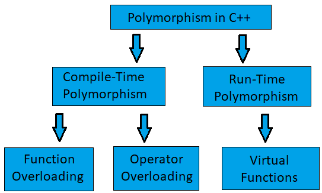

## Polymorphism

- Polymorphism means “one interface, many forms.”
The same function call behaves differently depending on the object or context.

Greek roots:
Poly = many
Morph = forms

* Polymorphism means "many forms." In C++, it means that a single interface (like a function name or an operator) can be used for a general class of actions, and the specific action is chosen based on the context. The "context" is what determines whether the decision is made at compile-time or runtime.

- Polymorphism allows a single interface to represent multiple behaviors, enabling compile-time overloading and runtime method overriding through dynamic dispatch.

**LSP** (Liskov Substitution Principle):
- obj of the super-class should be replaced with obj of its sub-class without breaking the application

LSP ensures that polymorphism actually works safely.

If you can write:
void process(Shape& s) {
    s.draw();
}
Then any derived class of Shape must behave correctly without breaking expectations.
📌 If substituting a derived object breaks logic → LSP is violated.
What “Substitutable” Means (Deep Meaning)

A derived class must not:

Break assumptions made by the base class

Weaken behavior guarantees

Strengthen restrictions unexpectedly

In short:
Derived classes must honor the contract of the base class.

**🧩 Why polymorphism exists (very important)**

- Removes if-else chains
- Enables runtime decision making
- Improves extensibility

**Types of ppolymorphism**

1. Compile time (Static)
2. Runtime.    (dynamic)

**1️⃣ Compile-Time Polymorphism (Static)**

- Decision is made at compile time.
- It's achieved by function overloading. The compiler looks at the function's signature (name and parameter types) and matches it to the correct function at compile time.
*  Compile-time polymorphism means:
- The compiler decides which function to call before the program runs.
 
  a. *function overloading*

  - Same function name, different: parameters or number or type of arguments

class Calculator {
public:
    int add(int a, int b) {
        std::cout << "Adding two integers.\n";
        return a + b;
    }

    double add(double a, double b) {
        std::cout << "Adding two doubles.\n";
        return a + b;
    }
};

int main() {
    Calculator calc;
    calc.add(5, 10);       // At compile time, this is bound to add(int, int)
    calc.add(5.5, 10.5);   // At compile time, this is bound to add(double, double)
}

b. *operator overloading* (only in C++).

- Part 1: The Core Idea - Abstraction and Intuition
At its heart, operator overloading is a form of syntactic sugar and a powerful tool for abstraction.

The core idea is to allow user-defined types (your classes) to work with the existing C++ operators (+, -, *, /, ==, <<, (), etc.) in a way that is natural and meaningful for that type.

The "Why":
Without operator overloading, working with objects would be cumbersome. Imagine you have a Vector2D class.

// Without operator overloading
Vector2D v1(1, 2);
Vector2D v2(3, 4);
Vector2D result = v1.add(v2); // Functional, but clunky
if (v1.isEqualTo(v2)) { ... } // Verbose

// With operator overloading
Vector2D v1(1, 2);
Vector2D v2(3, 4);
Vector2D result = v1 + v2;    // Intuitive, mathematical
if (v1 == v2) { ... }         // Clean, readable

or e.g
Hero obj;
//verbose
obj.h;
obj.w;
obj.l;

with opr overloading

cout<obj;

**operators that cant be overloaded
:: | ?: | . | .* | sizeof | typeid

**how**

1.  returnType operatorSymbol(parameters);

- For example, to overload the addition operator +:

Vector2D operator+(const Vector2D& lhs, const Vector2D& rhs);

- When the compiler sees an expression like v1 + v2, it translates it into a function call: operator+(v1, v2).

2. The Two Flavors - Member vs. Non-Member Functions

- *a. As a Member Function*

- When you overload an operator as a member function, the left-hand operand of the operator is the object itself (*this), and the right-hand operand is passed as the parameter.

class Vector2D {
public:
    // ...
    // The left-hand operand is 'this', the right-hand is 'rhs'
    Vector2D operator+(const Vector2D& rhs) const;
};

- How v1 + v2 is interpreted:
The compiler translates this to v1.operator+(v2). v1 is the object on which the method is called, and v2 is the argument.

When to Use It:

- Required for certain operators: = (assignment), () (function call), [] (subscript), -> (member access) must be member functions.
- When the operator modifies the left-hand operand: This is the most natural fit. For operators like +=, -=, *=, or prefix ++/--, the object is changing itself.

#### operator overloading of a++ or ++a:

class Counter {
    int x;
public:
    Counter(int x = 0) : x(x) {}

    // Prefix
    Counter& operator++() {
        ++x;
        return *this;
    }

    // Postfix
    Counter operator++(int) {
        Counter temp = *this;
        x++;
        return temp;
    }

    void show() const {
        cout << x << endl;
    }
};

Counter a(5);

++a;   // calls operator++()

a++;   // calls operator++(int)

a.show();

That dummy int is never passed by the user.

# // Member function is perfect for +=
Vector2D& Vector2D::operator+=(const Vector2D& rhs) {
    this->x += rhs.x;
    this->y += rhs.y;
    return *this; // Allow chaining: v1 += v2 += v3;
}

- **b. As a Non-Member (Free) Function**

- When you overload an operator as a non-member function, both operands are passed as parameters. The function is typically declared as a friend of the class if it needs access to private members, or it can work using the class's public getter methods.

Syntax:
class Vector2D {
    // ... class definition
    // Make the function a friend so it can access private members x and y
    friend Vector2D operator+(const Vector2D& lhs, const Vector2D& rhs);
};

// Implementation outside the class
Vector2D operator+(const Vector2D& lhs, const Vector2D& rhs) {
    return Vector2D(lhs.x + rhs.x, lhs.y + rhs.y);
}

**When to Use It (The Crucial Reason): Symmetry**

Non-member functions are essential for operators where the left-hand operand might not be an object of your class.

Consider our Vector2D class. What if we want to support Vector2D + double (scaling a vector)?

// This works fine as a member function
Vector2D Vector2D::operator+(double scalar) const {
    return Vector2D(this->x + scalar, this->y + scalar);
}

// Usage:
Vector2D v(1, 2);
Vector2D result = v + 5.0; // OK! v.operator+(5.0)

- But what if the user writes it the other way around? 5.0 + v.

Vector2D v(1, 2);
Vector2D result = 5.0 + v; // COMPILE ERROR!

- This fails because the double type has no operator+(const Vector2D&) method. The compiler can't call a method on 5.0.

- The Solution: Make it a non-member function.

// Non-member function handles both cases
Vector2D operator+(const Vector2D& lhs, double scalar) {
    return Vector2D(lhs.x + scalar, lhs.y + scalar);
}

Vector2D operator+(double scalar, const Vector2D& rhs) {
    return rhs + scalar; // Just call the other version for simplicity
}

// Usage:
Vector2D v(1, 2);
Vector2D r1 = v + 5.0; // Calls operator+(v, 5.0)
Vector2D r2 = 5.0 + v; // Calls operator+(5.0, v) - NOW IT WORKS!

- Rule of Thumb: For binary operators like +, -, *, /, ==, !=, <, >, prefer implementing them as non-member functions to ensure symmetry and handle cases where the left-hand operand is not your class type.

**A Complete, Practical Example**
Let's put it all together in a Vector2D class.

#include <iostream>

class Vector2D {
private:
    double x, y;

    // Make non-member operators friends to access private members
    friend Vector2D operator+(const Vector2D& lhs, const Vector2D& rhs);
    friend std::ostream& operator<<(std::ostream& os, const Vector2D& vec);

public:
    Vector2D(double x = 0.0, double y = 0.0) : x(x), y(y) {}

    // Member function for modifying operators like +=
    Vector2D& operator+=(const Vector2D& rhs) {
        this->x += rhs.x;
        this->y += rhs.y;
        return *this;
    }
};

// Non-member function for symmetric addition
Vector2D operator+(const Vector2D& lhs, const Vector2D& rhs) {
    return Vector2D(lhs.x + rhs.x, lhs.y + rhs.y);
}

// Non-member function for stream insertion (must be non-member!)
// The left operand is std::ostream, not our class.
std::ostream& operator<<(std::ostream& os, const Vector2D& vec) {
    os << "(" << vec.x << ", " << vec.y << ")";
    return os;
}

int main() {
    Vector2D v1(1.0, 2.0);
    Vector2D v2(3.0, 4.0);

    Vector2D sum = v1 + v2; // Calls non-member operator+
    std::cout << v1 << " + " << v2 << " = " << sum << std::endl;

    sum += v1; // Calls member operator+=
    std::cout << "Sum after += v1: " << sum << std::endl;

    return 0;
}

Output:
(1, 2) + (3, 4) = (4, 6)
Sum after += v1: (5, 8)

######
- In C++, operators can be overloaded as member or non-member functions.
* Member operators require the left operand to be the class object, while non-member operators allow greater flexibility and symmetry, often using friend for access

| Aspect        | Member Function      | Non-Member Function |
| ------------- | -------------------- | ------------------- |
| Left operand  | Must be class object | Can be anything     |
| Uses `this`   | ✔ Yes                | ❌ No                |
| Friend needed | ❌                    | Often ✔             |
| Symmetric ops | ❌ Poor               | ✔ Best              |
| Common use    | `=`, `[]`, `()`      | `+`, `<<`, `==`     |

3️⃣ Which operators MUST be member functions?
🚫 These operators cannot be non-member

| Operator | Reason                 |
| -------- | ---------------------- |
| `=`      | Needs access to `this` |
| `[]`     | Works on object        |
| `()`     | Function call operator |
| `->`     | Pointer semantics      |

4️⃣ Which operators are USUALLY non-member?

| Operator    | Reason                       |
| ----------- | ---------------------------- |
| `+ - * /`   | Symmetry                     |
| `== != < >` | Both operands equal          |
| `<< >>`     | Left operand often `ostream` |

# example to overload '<<'

- **Part 1: The Core Challenge - Why It Can't Be a Member Function**
- This is the most important concept to grasp. When you overload an operator as a member function, the object on the left-hand side of the operator is the one calling the function.

- For example, if operator+ were a member function of Vector2D:

- Vector2D Vector2D::operator+(const Vector2D& rhs);

The expression v1 + v2 is translated by the compiler into v1.operator+(v2). v1 is the object, and v2 is the parameter.

Now, consider the << operator. The expression is:

std::cout << myBook;

- The object on the left-hand side is std::cout, which is an object of type std::ostream. We cannot go into the std::ostream class and add a member function for our custom Book class!

- Conclusion: The << operator must be overloaded as a non-member function because the left-hand operand is an object of a different class (std::ostream).

**Part 2: The Solution - A Non-Member friend Function**
- Since the function must be a non-member, it needs a way to access the private members of your class. The most common and direct way to grant this access is to make the non-member function a friend of the class.

- A friend function is a function that is not a member of the class but is granted access to its private and protected members.

The Canonical Signature:
* std::ostream& operator<<(std::ostream& os, const MyClass& obj);

Let's break down this signature piece by piece:

- std::ostream& (Return Type): We return a reference to the output stream. This is critical because it allows for chaining. When you write std::cout << obj1 << obj2;, it's evaluated as (std::cout << obj1) << obj2;. The first call must return std::cout so it can be used as the left-hand operand for the second call.
- operator<<: The name of the function we are overloading.
- std::ostream& os: The first parameter is the stream we are writing to. It's passed by reference (&) because we are modifying it (we're inserting characters into its buffer).
- const MyClass& obj: The second parameter is the object we want to print. It's passed by const reference (const&) for two reasons:
- Efficiency: We avoid making an expensive copy of the object.
Safety: Printing should not change the object's state, so we mark it as const.

**Part 3: Complete Code Example**
Let's create a Book class and overload << to print its details.

#include <iostream>
#include <string>

class Book {
private:
    std::string title;
    std::string author;
    int year;
    double price;

public:
    Book(std::string t, std::string a, int y, double p)
        : title(t), author(a), year(y), price(p) {}

    // Declare the overloaded operator as a friend of the class
    // This gives it access to private members: title, author, etc.
    friend std::ostream& operator<<(std::ostream& os, const Book& book);
};

// --- Implementation of the friend function ---
// Note: It's a non-member function, so we don't prefix it with Book::
std::ostream& operator<<(std::ostream& os, const Book& book) {
    os << "Book Details:\n";
    os << "  Title:  " << book.title << "\n";
    os << "  Author: " << book.author << "\n";
    os << "  Year:   " << book.year << "\n";
    os << "  Price:  $" << book.price;
    return os; // Don't forget to return the stream!
}

int main() {
    Book book1("The C++ Programming Language", "Bjarne Stroustrup", 2013, 54.99);
    Book book2("Effective Modern C++", "Scott Meyers", 2014, 42.50);

    // Now we can print our Book objects just like built-in types!
    std::cout << book1 << std::endl << std::endl;
    std::cout << book2 << std::endl;

    // Demonstrate chaining
    std::cout << "Displaying two books:\n"
              << book1 << "\n\n"
              << book2 << std::endl;

    return 0;
}

**Part 4: Alternative - Using Public Getters (Maintaining Encapsulation)**
- Some developers argue that using friend breaks encapsulation because it grants another function full access to the class's internals. An alternative is to rely on the class's public interface (its "getters").

class Book {
    // ... private members as before ...
public:
    // ... constructor ...

    // Public "getter" methods
    std::string getTitle() const { return title; }
    std::string getAuthor() const { return author; }
    int getYear() const { return year; }
    double getPrice() const { return price; }
};

// The overload is NO LONGER a friend. It uses the public interface.
std::ostream& operator<<(std::ostream& os, const Book& book) {
    os << "Book Details:\n";
    os << "  Title:  " << book.getTitle() << "\n"; // Using a getter
    os << "  Author: " << book.getAuthor() << "\n"; // Using a getter
    os << "  Year:   " << book.getYear() << "\n";   // Using a getter
    os << "  Price:  $" << book.getPrice();         // Using a getter
    return os;
}

###
| Approach | Pros | Cons |
| :--- | :--- | :--- |
| **`friend` Function** | • More direct access, potentially more performant (no extra function calls). • Less boilerplate code if you don't need getters for anything else. | • Breaks encapsulation by giving a non-member full access. • Tightly couples the operator to the class's internal structure. |
| **Public Getters** | • **Maintains strong encapsulation.** The class controls how its data is accessed. • Considered better object-oriented design. | • More verbose to write. • Might have a tiny performance overhead due to the function calls (usually optimized away by the compiler). |

##### Runtime Polymorphism

- The Core Idea: You have a pointer or reference to a base class object, but it actually points to an object of a derived class. When you call a virtual function through that pointer/reference, the derived class's version of the function is executed.

- Runtime polymorphism in C++ is implemented using a vtable and vptr. Each class with virtual functions has a vtable containing function pointers, and each object stores a vptr pointing to its class’s vtable. When a virtual function is called via a base pointer or reference, the call is resolved at runtime by following the vptr to the vtable.

**Why Runtime Polymorphism Is Needed**

- the problem

code: render(shape);
 
- Without caring whether shape is:

Circle
Square
Triangle
Star (added later)

- ❌ Without runtime polymorphism

You end up with:

if (type == CIRCLE) ...
else if (type == SQUARE) ...

- Problems:

Tight coupling
Every new type → modify old code
Violates Open–Closed Principle

✅ With runtime polymorphism

shape.draw();
Now:
New shapes can be added
Existing code remains unchanged
Behavior varies at runtime

**Core Idea of Runtime Polymorphism**

- You call a function through a base class pointer/reference,
but the derived object’s function runs.

Shape* s = new Circle();
s->draw();   // Circle::draw(), not Shape::draw()

❓ How does C++ decide this at runtime?

👉 This is where vtable and vptr come in.

**The vtable (Virtual Table)**
- What is a vtable?

. A compiler-generated table
. Exists per class, not per object
. Contains function pointers to virtual functions

- Created when?
. When a class has at least one virtual function

* example:

class Shape {
public:
    virtual void draw();
};

Compiler creates:

Shape_vtable:
+------------------+
| &Shape::draw     |
+------------------+

Derived class
class Circle : public Shape {
public:
    void draw() override;
};

Compiler creates:

Circle_vtable:
+------------------+
| &Circle::draw    |
+------------------+

📌 Each class has its own vtable

**The vptr (Virtual Pointer)**

- What is vptr?

. A hidden pointer inside each object
. Points to that object’s class vtable

- Exists where?

. Inside every object of a class with virtual functions

Circle c;
Memory layout (simplified):

+------------------+
| vptr ----------+----> Circle_vtable
| data members    |
+------------------+

- When is vptr set?

. During constructor execution
. Base constructor sets base vptr
. Derived constructor overwrites it with derived vtable

📌 This is why virtual calls inside constructors behave differently.

**Runtime Call Flow (VERY IMPORTANT)**

When you write:

shapePtr->draw();

Step-by-step

. shapePtr points to an object (Circle / Square)

. Compiler sees draw() is virtual

At runtime:

. Read object’s vptr

. Follow it to the vtable

. Fetch function pointer for draw

. Call that function

Result

Circle object → Circle::draw

Square object → Square::draw

📌 Decision is made at runtime

**Why vtable/vptr Are Needed**

- Without them:

. Compiler cannot know actual object type
. Base pointer hides derived type

- With them:

Dynamic dispatch
Extensibility
Decoupled code
True polymorphism

💡 One-line insight

vtable + vptr = runtime function lookup system

**Overriding (How It Fits In)**
- What is overriding?
. A derived class provides its own implementation of a virtual function.

Rules:

Base function must be virtual

Same signature

Called via base pointer/reference

class Circle : public Shape {
public:
    void draw() const override;
};

What override does

Compile-time check
Prevents accidental mismatches
Does not affect vtable mechanism

**Why Virtual Destructor Matters**
Shape* s = new Circle();
delete s;

- Without virtual destructor:
 . Only Shape destructor runs
 . Circle resources leak

- With virtual destructor:
 . Destructor call goes through vtable
 . Correct cleanup

📌 Rule:
Any polymorphic base class must have a virtual destructor.

**NOTE**
- The syntax BaseClass* ptr = new DerivedClass(); is called upcasting. It is always safe and implicit because a DerivedClass object "is-a" BaseClass object. The DerivedClass object contains a complete BaseClass subobject within it.

- The syntax DerivedClass* ptr = new BaseClass(); is called downcasting. This is dangerous and illegal without an explicit cast. A BaseClass object is not a DerivedClass object; it doesn't have the extra members and functionality that DerivedClass added

* let inheritance be like : C -> B -> A.
- questions. what happens to these?

Assumes:

B : public A

C : public B

whoAmI() is virtual

Base destructor is virtual

Destruction always happens derived → base

A* obj = new A();
A* obj = new B();
B* obj = new A();
B* obj = new B();
A* obj = new C();
C* obj = new A();

| Statement              | Static Type | Dynamic Type | Compiles? | whoAmI() Called | Destruction Order        |
|------------------------|-------------|--------------|-----------|------------------|--------------------------|
| `A* obj = new A();`    | `A*`        | `A`          | Yes       | `A::whoAmI()`    | `~A()`                   |
| `A* obj = new B();`    | `A*`        | `B`          | Yes       | `B::whoAmI()`    | `~B()`, `~A()`           |
| `B* obj = new A();`    | `B*`        | `A`          | **No**    | N/A              | N/A                      |
| `B* obj = new B();`    | `B*`        | `B`          | Yes       | `B::whoAmI()`    | `~B()`, `~A()`           |
| `A* obj = new C();`    | `A*`        | `C`          | Yes       | `C::whoAmI()`    | `~C()`, `~B()`, `~A()`   |
| `C* obj = new A();`    | `C*`        | `A`          | **No**    | N/A              | N/A                      |

    
