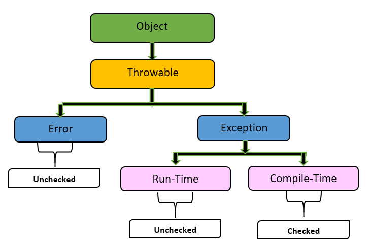
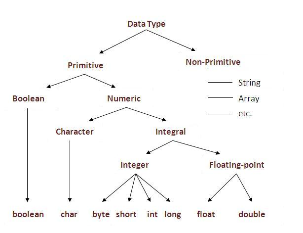

## A. Const Keyword
It prevents objects/variables/methods/pointers to modify their values.

### 1. const variable
```
const int MAX_USERS = 100;
MAX_USERS = 101; // COMPILE ERROR! Cannot modify a const variable.
```

### 2. const Pointers and References (The most important use case):
```
int value = 5;
int other = 10;
```
#### Pointer to const data (data is const, pointer is not)
```
const int* ptr_to_const = &value;
*ptr_to_const = 10; // ERROR: Cannot change the data it points to.
ptr_to_const = &other;  // OK: Can change what pointer points to.
```
#### const pointer (pointer is const, data is not)
```
int* const const_ptr = &value;
*const_ptr = 15;       // OK: Can change the data.
const_ptr = &other;  // ERROR: Cannot change the pointer itself.
```
#### const pointer to const data (both are const)
```
const int* const super_const = &value;
*super_const = 20;    // ERROR: Cannot change data.
super_const = &other; // ERROR: Cannot change pointer.
```

### QUESTION

#### 1.
```
const char* p = "12344";
const char** q = &p;
*q = "abcd"; // ??????
```
ans: no error: we can change the value of pointer p. but not the value pointer p points to
```
const char *s = ++P;
p = "xyz"
cout<< "*++s"; ?????
```

output -> 'z'

*++p → move → then read

*p++ → read → then move

#### 2. 
```
  const int x;
  x=10;
  cout<<x;
```
this will give us compile time error: its a syntax error:=> value should be decleared at the time of initialization
 
const variables MUST be initialized at declaration

#### 3. 
```
 int const s=9;
 cout<<s;
 ```
 output : 9;

s is just a value here , not a pointer
```
no '*' → NOT a pointer
'*' present → pointer
```

### 3. const Member Functions:

A const member function promises not to change the state of its object.
```
class Player {
private:
    int health;
public:
    int getHealth() const { // The 'const' is here
        // this->health = 50; // COMPILE ERROR! Cannot modify member in a const function.
        return this->health;
    }
};
```
Why: This allows you to call the function on const objects. This is essential for functions that take objects by const reference.
```
void printPlayerHealth(const Player& p) {
    std::cout << p.getHealth() << std::endl; // This only works if getHealth is const.
}
```

## B. Final keyword
Java does not have a const keyword in the same way. The concept of immutability is primarily handled by final.

final is the primary keyword in Java for defining things that cannot be changed. In C++, its meaning is more recent and specific.

#### final variables
A final variable can be assigned a value only once.
```
public class Account {
    private final String accountNumber; // Must be set in the constructor
    private final double interestRate = 0.05; // Can be set here

    public Account(String acctNum) {
        this.accountNumber = acctNum; // OK: First and only assignment.
        // this.accountNumber = "new"; // COMPILE ERROR!
    }
}
```
Why: To create immutable objects, which are inherently thread-safe and easier to reason about.

#### final methods:

A final method cannot be overridden by a subclass.
```
class Parent {
    public final void printSocialSecurityNumber() {
        // Sensitive logic that should not be changed.
    }
}
```

#### final class

A final class cannot be inherited from.
```
public final class String { /* ... */ }
// public class MyString extends String { } // COMPILE ERROR!
```
Why: For security and design. The String class is final to prevent people from breaking its guarantees (e.g., immutability).

#### In C++ (C++11 and later):

final in C++ is used to prevent further derivation.
```
class Base {
public:
    virtual void doSomething() { /* ... */ }
};

class Derived final : public Base { // 'final' here prevents inheritance from Derived
public:
    void doSomething() override { /* ... */ }
};

// class MoreDerived : public Derived { } // COMPILE ERROR! Cannot inherit from a final class.
```

## C. Static keyword

Static members belong to the class itself, not to any specific instance of the class. There is only one copy of a static member, shared by all objects.

#### 1. static variable:
C++
```
class Employee {
private:
    static int employeeCount; // Declared in class
    std::string name;
public:
    Employee(std::string name) : name(name) {
        employeeCount++; // Increment the shared counter
    }
};
```
In C++, you must also define the static variable outside the class:
```
int Employee::employeeCount = 0;
```
static → value persists between function calls

#### 2. static methods
Static methods can be called without creating an instance of the class.
```
class MathUtils {
public:
    // static method
    static int add(int a, int b) {
        return a + b;
    }
};

int main() {
    // call without creating object
    cout << MathUtils::add(10, 20);
    return 0;
}
```

## D. super keyword (only in java)

The super keyword is a reference variable that is used to refer to the immediate parent class of an object.

We can access the variables/contructors/methods of parent class after inhertance using super keyword

C++ does not have a `super` keyword. Instead, it uses the more general **Scope Resolution Operator `::`** to achieve the same goals.

| Task                    | Java Keyword           | C++ Equivalent                  | Where It's Used                                      |
|-------------------------|------------------------|----------------------------------|------------------------------------------------------|
| Call Parent Constructor | `super(args);`         | `ParentClass(args)`              | First line of constructor / initializer list          |
| Call Parent Method      | `super.methodName();`  | `ParentClass::methodName();`     | Inside child class methods                           |
| Access Parent Field     | `super.fieldName;`     | `ParentClass::fieldName;`        | Inside child class methods                           |

## E. enums (enumeration):
It is a user-defined data type that lets you define a set of named constant values, making code more readable, safer, and self-documenting.

examples:
---
```
enum Color {
    Red,
    Green,
    Blue
}
Color c = Green;

Red = 0
Green = 1
Blue = 2
(by default)
---
enum ErrorCode {
    OK = 200,
    NotFound = 404,
    ServerError = 500
};
---
enum class Direction {
    North,
    South,
    East,
    West
};

Direction d = Direction::North;
int x = Direction::North;   // error
 Must cast explicitly:
int x = static_cast<int>(Direction::North);
```
---

## F. finalise method():

In JAVA finalize() is a method called by the garbage collector before destroying an object to perform cleanup activities.
```
 class FileHandler {
    @Override
    protected void finalize() {
        System.out.println("Object destroyed, closing file");
    }
}

public class Main {
    public static void main(String[] args) {
        FileHandler f = new FileHandler();
        f = null;        // eligible for GC
        System.gc();     // request GC
    }
}
```
⚠️ Output is NOT guaranteed because GC is unpredictable.

🔹 Why finalize() is considered BAD / dangerous

1️⃣ Not guaranteed to run

- GC may never run
- JVM may exit before finalize() is called

2️⃣ Unpredictable timing

- You don’t know WHEN it will run:
   - immediately
   - much later
   - or never

3️⃣ Performance overhead

- Objects with finalize() take longer to collect
- GC must do extra work

## G. Aggregation/generalization/composition

#### 1. Aggregation (HAS-A, weak relationship)

Aggregation represents a HAS-A relationship where the child object can exist independently of the parent.
- Parent and child are related, but child does NOT depend on parent’s lifetime.

🔹 Example
```
class Student {};

class College {
    vector<Student*> students;  // aggregation
};
```
Student exists even if College is destroyed

College just references students

🔹 Real-world analogy

- College HAS students
- Team HAS players
- Library HAS books

If the college closes, students still exist.

🔹 UML Symbol: 

- Hollow diamond ◇

#### 2. Composition (HAS-A, strong relationship)

Composition is a strong HAS-A relationship where the child CANNOT exist without the parent.
- Child’s lifetime is fully controlled by the parent.

example:
```
class Engine {};

class Car {
    Engine engine;   // composition
};
```
If Car is destroyed → Engine is destroyed

Engine has no meaning without Car

🔹 Real-world analogy

- House HAS rooms
- Car HAS engine
- Human HAS heart

Destroy the parent → child is destroyed.

🔹 UML Symbol
- Filled diamond ◆

#### 3. Generalization (IS-A relationship / Inheritance)

Generalization represents an IS-A relationship using inheritance.
- Child class is a specialized form of parent class.
```
  class Animal {
public:
    void eat();
};

class Dog : public Animal {
};
```
Dog IS-AN Animal

Inherits behavior and properties

🔹 Real-world analogy

- Dog is an Animal
- Car is a Vehicle
- Student is a Person

🔹 UML Symbol

- Arrow with hollow triangle ▲

**✅ Design Rule (Golden Rule)**

Prefer composition over inheritance unless there is a true IS-A relationship.

### Q. Difference between aggregation and composition?

Lifecycle dependency is the key difference.

| Relationship   | Meaning        | Dependency        | Keyword |
| -------------- | -------------- | ----------------- | ------- |
| Aggregation    | HAS-A (weak)   | Child independent | uses    |
| Composition    | HAS-A (strong) | Child dependent   | owns    |
| Generalization | IS-A           | Inheritance       | extends |

## H. when to use stack over classes?

Use a stack when the problem is about behavior (LIFO operations); use classes when the problem is about entities with state and responsibilities.

⚠️ Important clarification:
- Stack is not an alternative to a class
- A stack is usually IMPLEMENTED as a class

## I. try-catch block

try–catch is NOT just an if–else.
- It’s a control-flow mechanism built on stack unwinding, metadata tables, and runtime support.

#### 1️⃣ What the compiler does (before runtime)

When the compiler sees:
```
try {
    f();
} catch (int e) {
    handle(e);
}
```
It does NOT generate normal branching code.

Instead, it generates:

🔹 a) Exception metadata tables

- Which instructions are inside try
- Which catch blocks exist
- What types they handle
- Cleanup functions (destructors)

👉 Stored in exception tables, not inline code.

🔹 b) No cost in normal execution (C++)

If no exception occurs:
- try block runs like normal code
- No checks
- No branching
- Almost zero runtime overhead

This is called:
- *Zero-cost exception model (C++)*

#### 2️⃣ What happens when an exception is thrown
```
throw x;
```
This triggers exception handling runtime.

#### 3️⃣ Stack Unwinding (core concept)

Suppose call stack is:
```
main()
 └── A()
     └── B()
         └── C()   ← throw happens here
```
Step-by-step:

🔹 Step 1: Exception object created

  - Exception value copied/stored
  - Type info attached

🔹 Step 2: Runtime searches for a handler

 The runtime walks up the call stack:

  - Check C() → no handler
  - Check B() → no handler
  - Check A() → has catch(int)
  - STOP

🔹 Step 3: Stack unwinding begins

 While moving upward:
  - All local objects’ destructors are called
  - This guarantees RAII safety

Example:
```
void B() {
    File f;   // destructor runs!
    C();
}
```
🔹 Step 4: Control jumps to catch block
```
catch (int e) {
    handle(e);
}
```
Execution resumes here, skipping everything in between.

#### 4️⃣ Why try–catch is slow when an exception occurs

Throwing an exception is expensive because:

| Reason           | Cost |
| ---------------- | ---- |
| Stack walking    | High |
| Destructor calls | High |
| Cache misses     | High |
| Type matching    | High |

👉 Exceptions are for exceptional cases, not normal control flow.

#### 6️⃣ Language-specific notes

🔹 C++

- Zero cost if no exception
- Very expensive when thrown
- Destructors always run
- Can throw any type

throw std::runtime_error("fail");

🔹 Java

- Exceptions are objects
- try–catch has runtime checks
- Slower even without throwing
- No deterministic destruction

🔹 Finally block
```
try {
    risky();
} finally {
    cleanup();
}
```
finally runs:
- after try
- after catch
- even if exception is thrown

Implemented by duplicating cleanup logic in bytecode.

## J. error vs exception
 
 

#### 1️⃣ Exception

An Exception is an abnormal condition that:
- Occurs during program execution
- Can be anticipated
- Can be handled or recovered from

🔹 Examples
 - File not found
 - Invalid input
 - Network timeout
 - Divide by zero
 - Null reference
```
try {
    int x = 10 / 0;
} catch (ArithmeticException e) {
    // recover
}
```
🔹 Characteristics:
 - Caused by program logic or external factors
 - Part of normal program flow
 - Can be caught and handled
 - Allows program to continue

🔹 Types (Java):

| Type      | Example              |
| --------- | -------------------- |
| Checked   | IOException          |
| Unchecked | NullPointerException |


#### 2️⃣ Error

An Error represents a serious problem that:
- Is not expected
- Is not recoverable
- Indicates system or JVM failure

🔹 Examples
- OutOfMemoryError
- StackOverflowError
- VirtualMachineError
- LinkageError

exmple: 
```
int[] a = new int[Integer.MAX_VALUE];  // OutOfMemoryError
```

🔹 Characteristics:
- Caused by environment or JVM
- Program should NOT try to handle
- Usually terminates the application
- Indicates something is fundamentally broken

#### 3️⃣ Key Differences (Very Important)

| Aspect             | Exception             | Error             |
| ------------------ | --------------------- | ----------------- |
| Recoverable        | Yes                   | No                |
| Caused by          | Program / Input       | JVM / System      |
| Expected           | Yes                   | No                |
| Should be handled? | Yes                   | No                |
| Package (Java)     | `java.lang.Exception` | `java.lang.Error` |
| Impact             | Local                 | Global            |
| Example            | IOException           | OutOfMemoryError  |


#### 4️⃣ Throwable Hierarchy (Java)

Throwable
├── Error
└── Exception
    ├── Checked Exception
    └── RuntimeException

#### 5️⃣ C++ Perspective (Important)

C++ does NOT have Error vs Exception classes like Java.

Everything is an exception

But conceptually:
- Logic issues → exceptions
- Fatal failures → terminate program

throw runtime_error("file missing");

Fatal errors (segfault, stack overflow):

- Cannot be caught safely
- Program terminates

#### Note:
Error and error are different

Error is java concept as discussed above

but “error” = anything that goes wrong in a program
- The different types of errors are compile-time errors, run-time errors, and logical errors.

| error Type   | Detected When   | Example          |
| ------------ | --------------- | ---------------- |
| Compile-time | Compilation     | Syntax error     |
| Run-time     | Execution       | Divide by zero   |
| Logical      | After execution | Wrong output     |
| Linker       | Linking stage   | Missing function |

#### Note

The JVM (Java Virtual Machine) is a runtime engine that executes Java programs by converting Java bytecode into machine-specific instructions.

In short:
- JVM lets Java be “write once, run anywhere.”

## K. how many intances can be created for an abstract class?

Zero.
- 👉 You cannot create even a single instance of an abstract class.

Why?
- An abstract class is incomplete — it may contain abstract (unimplemented) methods, so the language forbids instantiation.

Example (Java / C++ concept)
```
abstract class Animal {
    abstract void sound();
}
```
❌ This is illegal:
```
Animal a = new Animal(); // compile-time error
```
So how is an abstract class used?

✅ Through inheritance:
```
class Dog extends Animal {
    void sound() {
        System.out.println("Bark");
    }
}

Animal a = new Dog();   // ✅ valid (polymorphism)
```
Instance is of Dog

Reference type is Animal

👉 Still 0 instances of Animal, only Dog exists.

Important Clarification (Interview Trap ⚠️)

❓ “Can an abstract class have a constructor?”
- ✅ Yes
```
abstract class A {
    A() {
        System.out.println("Constructor");
    }
}
```
Constructor runs when subclass object is created

Still no instance of abstract class itself

What about anonymous classes? (Advanced):
```
// 1. Used only once → no need to name
// 2. Avoids extra class creation
// 3. Keeps code short and local
```
```
Animal a = new Animal() {
    void sound() {
        System.out.println("Meow");
    }
};
```
Looks tricky, but:
- This creates an anonymous subclass
- Not an instance of abstract class directly

Still counts as:

- 0 abstract-class instances

## L. why JAVA is not purely object oriented language?

Java is not purely object-oriented because it supports primitive data types and static methods that are not objects.

#### What “purely object-oriented” means

A pure OOP language must satisfy:
- Everything is an object
- All operations are done via objects & methods
- No primitive data types
- No global/static procedures outside objects

Examples of pure OOP languages:

- Smalltalk
- Ruby (mostly)
- Eiffel



#### 1️⃣ Primitive data types 

Java has 8 primitive types:
  - int, char, boolean, byte, short, long, float, double

These are NOT objects.
- int x = 10;        // ❌ not an object
- Integer y = 10;   // ✅ object

➡️ Since primitives are not objects → Java fails purity.

#### 2️⃣ Static methods break object-centric design
```
public static void main(String[] args) {
}
```
main() belongs to a class, not an object

Called without creating an object

Pure OOP requires:
 - behavior must be invoked via objects

#### 3️⃣ Use of wrapper classes is optional

Java introduced wrapper classes (Integer, Double, etc.)

but they are workarounds, not replacements.

Autoboxing:

Integer x = 5;   // behind the scenes

Still, primitives exist at JVM level.

#### 4️⃣ No operator overloading (design trade-off)

a + b
- '+' is NOT a method call

Primitive arithmetic is built-in

Pure OOP would require:
- a.add(b)
(Java allows this only via objects, not primitives)

#### 5️⃣ Low-level concepts still exposed

- Arrays are not full objects
- null reference exists
- Primitive comparisons bypass objects

These leak procedural behavior.

## M. friend class , friend function

In C++, friend is a special mechanism that lets external code access a class’s private and protected members. It’s powerful and dangerous if misused.

Java does not support friend functions or friend classes; similar behavior is achieved using package-private access, protected members, or inner classes.

🔑 Big Idea:
- Friendship breaks encapsulation deliberately.
- It allows trusted functions or classes to see a class’s internals.

#### Friend Function

A friend function is not a member of the class, but it can access the class’s private/protected data.

🔹 Syntax & Example
```
class Box {
private:
    int width;
public:
    Box(int w) : width(w) {}

    friend void printWidth(const Box& b); // declaration
};

void printWidth(const Box& b) {            // definition
    cout << b.width;  // allowed
}
```
🔹 Key points
- Declared inside the class
- Defined outside
- Called like a normal function
- Useful for symmetric operations (e.g., operators)

🔹 Note:
```
 class A { friend class B};
 class B{};
 //now B can access all the members( private, public, protected) of class A;
 
  class C public B {

  }
  question : can C access the private members of class A?
  
```
answer: no 

why NO?
- friendship is NOT inherited
- Only B is friend of A
- C is just a child of B → NOT friend of A

## N. Initialization list

In C++, an Initialization List (more precisely: constructor initializer list) is a way to initialize class data members directly before the constructor body runs.

It is faster, safer, and sometimes mandatory.

Syntax:
```
class MyClass {
    int x;
    int y;

public:
    MyClass(int a, int b) : x(a), y(b) {
        // constructor body
    }
};
```
Here:
- x(a), y(b) → initialization list
- Members are initialized before the constructor body executes

### When Initialization List is MANDATORY 🚨

#### 1️⃣ const data members
```
class A {
    const int x;
public:
    A(int v) : x(v) {}  // REQUIRED
};
```
❌ Assignment inside constructor body is illegal.

#### 2️⃣ Reference members
```
class B {
    int& ref;
public:
    B(int& r) : ref(r) {}  // REQUIRED
};
```
References must be initialized when created.

#### 3️⃣ Base class initialization
```
class Base {
public:
    Base(int x) {}
};

class Derived : public Base {
public:
    Derived(int x) : Base(x) {}
};
```

Base class must be initialized before derived class body.

#### 4️⃣ Member objects without default constructors
```
class Engine {
public:
    Engine(int hp) {}
};

class Car {
    Engine e;
public:
    Car() : e(120) {}   // REQUIRED
};
```
🔹 Order of Initialization (Very Important ⚠️)

- Initialization order is NOT the order in the list

It is:
  - Base class
  - Data members in the order of declaration
  - Constructor body
```
class Test {
    int a;
    int b;
public:
    Test() : b(2), a(1) {}  // a is still initialized first!
};
```
Compiler may warn, but it still follows declaration order.

## O. default arguments

Default arguments are values assigned to function parameters that are automatically used when the caller does not provide those arguments.
```
void greet(string name = "Guest") {
    cout << "Hello " << name;
}

greet();        // Hello Guest
greet("Tahir"); // Hello Tahir
```
1️⃣ Must be from right to left
```
void f(int a, int b = 10, int c = 20);  // ✅
void g(int a = 1, int b);              // ❌ INVALID
```
Once a parameter has a default value, all parameters to its right must also have defaults.

## what is Singleton Design Pattern

The Singleton Design Pattern ensures that a class has only one instance and provides a global point of access to that instance.
- Create once → reuse everywhere


Use Singleton when:
- Exactly one object should exist
- That object coordinates shared resources

Common real-world uses:
- Database connection pool
- Logger
- Configuration manager
- Cache manager
- Thread pool

Basic Singleton (C++ – Lazy Initialization)
```
class Singleton {
private:
    Singleton() {}              // private constructor

public:
    static Singleton& getInstance() {
        static Singleton instance;  // created once
        return instance;
    }

    Singleton(const Singleton&) = delete;            // no copy
    Singleton& operator=(const Singleton&) = delete; // no assign
};
```
Usage
```
Singleton& s1 = Singleton::getInstance();
Singleton& s2 = Singleton::getInstance();
cout << (&s1 == &s2); // true
```

## JAVA vs C++

### JAVA:

“Write Once, Run Anywhere”

Java Source Code (.java)
        ↓
Java Compiler (javac)
        ↓
Bytecode (.class)  ← platform independent
        ↓
JVM (Windows / Linux / macOS)
        ↓
Machine Code (OS + CPU dependent)

#### Key Points: 

Bytecode is platform-independent

JVM is platform-dependent

Same .class file runs everywhere as long as JVM exists

Bytecode is an intermediate, platform-independent instruction set generated by a compiler and executed by a virtual machine, not directly by the CPU.

The JVM (Java Virtual Machine) is a runtime environment that executes Java bytecode and manages everything needed to run a Java program—independent of the underlying hardware and OS.

### C++:

C++ Source Code (.cpp)
        ↓
C++ Compiler (gcc / clang / MSVC)
        ↓
Native Machine Code (.exe / binary)
        ↓
Direct execution on OS + CPU

#### Key Points

- Compiled directly to machine code
- Output binary is CPU + OS dependent
- Different binaries needed for:
   - Intel vs ARM
   - Windows vs Linux

## Garbage Collector:

whenever gc wants to clean.

#### finilize keyword:

 manually calling GC for cleanup, called before GC


