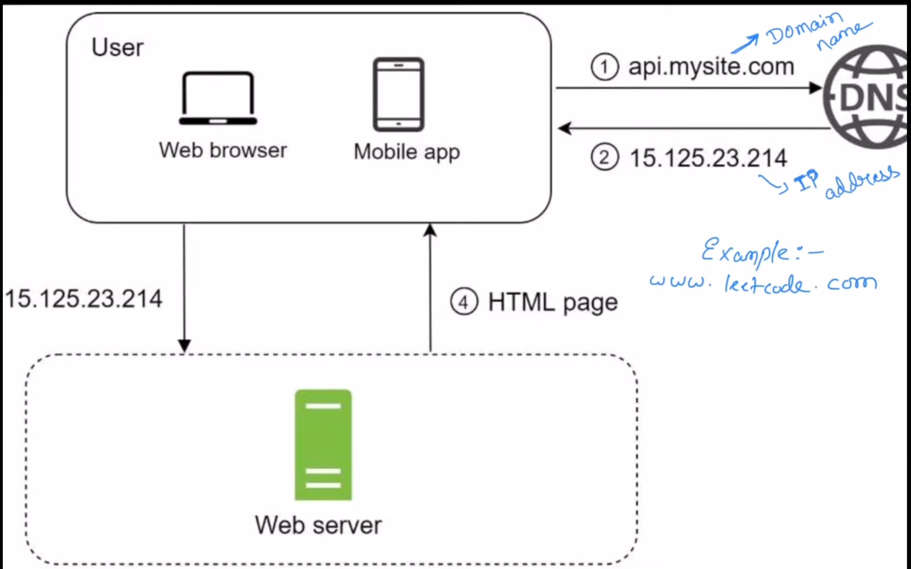

## What is Internet:

The Internet is a global network of interconnected networks that allows computers and servers worldwide to communicate and exchange data using standard rules (protocols).

What the Internet is made of
- Billions of devices (computers, phones, servers)
- Routers and switches
- Physical links (fiber optics, submarine cables, satellites)
- Common communication rules (TCP/IP)

How the Internet works (high level)
- Your device connects to an ISP (internet service protocol)
- Data is broken into packets
- Routers forward packets across networks
- Packets reach the destination
- Response packets return the same way

No single central controller exists.

Internet vs World Wide Web (important)
 - Internet → infrastructure (networks + protocols)
 - Web (WWW) → a service running on the Internet (HTTP, websites)

Email, FTP, video calls also use the Internet but are not the Web.

## what is an ip-address:
- An IP address (Internet Protocol address) is a unique numerical identifier assigned to every device on a network so data knows where to go.
why it exists:
- Networks don’t understand names — they route data using numbers. e.g : 142.250.183.206
     - This number identifies a specific machine on the internet.

What an IP does
- Identifies a device (identity)
- Locates a device on a network (location)
- Enables routing of packets

#### Types of IP Addresses

a) IPv4
 - 32-bit number
 - Written as 4 numbers (0–255)
192.168.1.1

- ~4.3 billion possible addresses
- Almost exhausted

b) IPv6
- 128-bit number
- Written in hexadecimal
2001:0db8:85a3::8a2e:0370:7334
- Practically unlimited addresses
- Designed to replace IPv4

#### Public vs Private IP

Public IP
- Globally unique
- Assigned by ISP
- Used on the internet

Private IP
- Used inside local networks
- Not routable on the internet

10.0.0.0 – 10.255.255.255
192.168.0.0 – 192.168.255.255

#### Static vs Dynamic IP

Static IP
- Fixed
- Doesn’t change
- Used by servers

Dynamic IP
- Assigned temporarily (via DHCP)
- Changes over time
- Used by home devices

ISP → gives you public IP

Router → gives devices private IPs

Public IP can be static or dynamic

## What is domain name:

A domain name is a human-readable name that maps to an IP address.
- example: google.com → 142.250.183.206

- Humans remember names.
- Machines need numbers.

Domain name structure
- example: www.api.example.co.in

Breakdown:
- in → Top-level domain (TLD)
- co → Second-level domain
- example → Registered domain
- api → Subdomain
- www → Subdomain (convention)

Hierarchy is right to left.

## What is DNS?

- DNS (Domain Name System) is the phonebook of the internet.
- It translates:
    - domain name → IP address

How DNS works (step-by-step)
- You enter google.com
- Browser checks cache
- OS checks cache
- DNS Resolver (ISP) is queried
- Resolver asks:
   - Root server
   - TLD server (.com)
   - Authoritative server
- IP address returned
- Browser connects to IP

This usually happens in milliseconds.

## What is ISP?
An ISP (Internet Service Provider) is an organization that connects you to the Internet and assigns you an IP address so your device can send and receive data globally.

## visualization:
domain-name: www.leetcode.com

ip-address: 15.244.24.577

now, we need ip address from domain for talking with the server. DNS ( 3rd party serves provider ) will help retrun ip-address from domain-name

